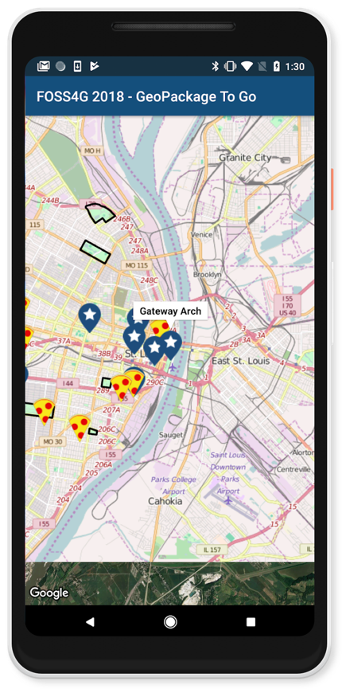

# GeoPackage To Go: Offline Maps from Web to Mobile
## FOSS4G North America 2018 - St. Louis, MO

A [GeoPackage](https://www.geopackage.org/) example using the [GeoPackage Android Map Library](https://github.com/ngageoint/geopackage-android-map) from the session at [FOSS4G](https://2018.foss4g-na.org/session/geopackage-go-offline-maps-web-mobile). There are also examples for [iOS](https://github.com/ngageoint/geopackage-ios/tree/master/docs/examples/swift/GeoPackage-to-go-iOS) and the [web](https://github.com/ngageoint/geopackage-js/tree/master/docs/examples/GeoPackageToGo).



Disclaimer: Some images appearing in this example app use map layers from [OpenStreetMap](https://www.openstreetmap.org/) or the native platform mapping services from the mobile device. Map layers from native platform mapping services are used in accordance with NGA’s developer license agreement with Google.

This is a demo application that showcases how you might interact with a GeoPackage on Android using the GeoPackage Android Map Library. The [sample GeoPackage](https://github.com/ngageoint/geopackage-android-map/blob/master/docs/examples/kotlin/GeoPackageToGoAndroid/app/src/main/assets/StLouis.gpkg?raw=true) contains some information about pizza shops and points of interest near in the St. Louis area. Using the GeoPackage Android Map library, this app shows a map of those sites.

You will need to set up your own [Google Maps API key](https://console.developers.google.com/) and add it to ~/.gradle/gradle.properties

```
DEBUG_MAPS_API_KEY=<AIza your Google Maps API key here>
RELEASE_MAPS_API_KEY=<AIza your Google Maps API key here>
```

Want to learn more? See the full API [documentation](https://ngageoint.github.io/geopackage-android-map/docs/api/).

### Run

You will need a [Android Studio](https://developer.android.com/studio/) to run this example, Android device optional since you can use the simulator.


### Adding GeoPackage to your project

This example uses Kotlin, but this library will work with Java as well.

There are two Android projects, [geopackage-android-map](https://github.com/ngageoint/geopackage-android-map) which uses the built in Google map to display data, and [geopackage-android](https://github.com/ngageoint/geopackage-android) which you can use with any third party map view such as OSMDroid.

To add geopackage-android-map, add it to the dependencies section of the build.gradle in your app folder in Android Studio.

```
dependencies {
  ...
  implementation "mil.nga.geopackage.map:geopackage-android-map:3.5.0"
  ...
}
```

### Code Walkthrough

To view the full example code, see [MapsActivity.kt](https://github.com/ngageoint/geopackage-android-map/blob/master/docs/examples/kotlin/GeoPackageToGoAndroid/app/src/main/java/mil/nga/geopackagetogoandroid/MapsActivity.kt).

First we grab the GeoPackage out of the app bundle.

```kotlin
mMap = googleMap
mMap.mapType = GoogleMap.MAP_TYPE_SATELLITE

val manager:GeoPackageManager = GeoPackageFactory.getManager(applicationContext)
manager.importGeoPackage("StLouis", applicationContext.assets.open("StLouis.gpkg"), true)
val geoPackage:GeoPackage = manager.open("StLouis")

val tileTable: String = geoPackage.tileTables[0]
val tileDao: TileDao = geoPackage.getTileDao(tileTable)
val overlay:TileProvider = GeoPackageOverlayFactory.getTileProvider(tileDao)
val overlayOptions = TileOverlayOptions()
overlayOptions.tileProvider(overlay)
overlayOptions.zIndex(-2.0f)
mMap.addTileOverlay(overlayOptions)

```

Next we grab the feature tables and loop through them. The icon that will be used for the features will be based on the table that the features come from. In Android, you can style the feature and set the text of the popup before you add it to the map.

```kotlin
val featureTables= geoPackage.featureTables
featureTables.forEach {
    val featureDao: FeatureDao = geoPackage.getFeatureDao(it)
    val converter = GoogleMapShapeConverter(featureDao.projection)
    val featureCursor: FeatureCursor = featureDao.queryForAll()

    var icon = BitmapDescriptorFactory.fromBitmap(BitmapFactory.decodeResource(applicationContext.resources, R.drawable.poi))
    if (it == "Pizza") { // In Kotlin, 'it' is out iterator
        icon = BitmapDescriptorFactory.fromBitmap(BitmapFactory.decodeResource(applicationContext.resources, R.drawable.pizza))
    }

    try {
        while (featureCursor.moveToNext()) {
            val featureRow = featureCursor.row
            val geometryData = featureRow.geometry
            val geometry = geometryData.geometry
            val googleMapShape:GoogleMapShape = converter.toShape(geometry)

            if (googleMapShape.shapeType == GoogleMapShapeType.LAT_LNG) {
                val markerOptions:MarkerOptions = MarkerOptions()
                    .title(featureRow.getValue("name") as String)
                    .position(googleMapShape.shape as LatLng)
                    .icon(icon)

                val newShape = GoogleMapShape(geometry.geometryType, GoogleMapShapeType.MARKER_OPTIONS, markerOptions)
                GoogleMapShapeConverter.addShapeToMap(mMap, newShape)
            } else {
                GoogleMapShapeConverter.addShapeToMap(mMap, googleMapShape)
            }
        }
    } finally {
        featureCursor.close()
    }
}

```

To move the map to be where we have data, you can grab the bounds of the tiles from the tile DAO and use a bounds builder to move the camera to the area where our map data is.

```kotlin
val boundingBox = tileDao.getBoundingBox(14)
val transform = ProjectionFactory
                    .getProjection(ProjectionConstants.EPSG_WEB_MERCATOR.toLong())
                    .getTransformation(ProjectionConstants.EPSG_WORLD_GEODETIC_SYSTEM.toLong())

val projectedBoundingBox = boundingBox.transform(transform)
val boundsBuilder = LatLngBounds.builder()
boundsBuilder.include(LatLng(projectedBoundingBox.minLatitude, projectedBoundingBox.minLongitude))
boundsBuilder.include(LatLng(projectedBoundingBox.minLatitude, projectedBoundingBox.maxLongitude))
boundsBuilder.include(LatLng(projectedBoundingBox.maxLatitude, projectedBoundingBox.minLongitude))
boundsBuilder.include(LatLng(projectedBoundingBox.maxLatitude, projectedBoundingBox.maxLongitude))

mMap.moveCamera(CameraUpdateFactory.newLatLngZoom(boundsBuilder.build().center, 12.0f))
```
